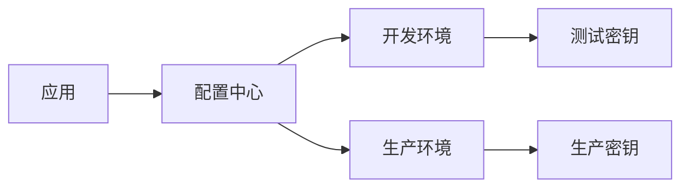

ChatMessage(role=assistant, content=### 代码评审报告

#### 1. 敏感信息处理（高风险）
**问题：**
- 原代码中硬编码了微信配置和API密钥（`weixin_appid`, `weixin_secret`, `qwen_apiKey`），存在严重安全风险。
- 修改后虽清空了敏感信息，但未提供安全的配置管理方案。

**建议：**
```java
// 推荐方案：使用配置文件 + 环境变量
@Value("${wechat.appid}")
private String weixin_appid;

@Value("${qwen.api-key}")
private String qwen_apiKey;
```
**配置示例（application.yml）：**
```yaml
wechat:
  appid: ${WECHAT_APPID}  # 从环境变量读取
  secret: ${WECHAT_SECRET}
qwen:
  api-key: ${QWEN_API_KEY}  # 从环境变量读取
```

#### 2. 功能完整性影响（中风险）
**问题：**
- 删除微信配置后，相关通知功能可能失效（需检查是否还有其他调用点）。
- `ZhipuAiClient` 的API Key被置空，会导致AI服务调用失败。

**建议：**
```java
// 添加配置校验
if (StringUtils.isEmpty(qwen_apiKey)) {
    throw new IllegalStateException("Qwen API Key未配置");
}
```

#### 3. 测试代码优化（低风险）
**问题：**
- `ApiTest.java` 中删除了异常测试用例（`Integer.parseInt("aaaaaa3")`），但新增了同样会抛异常的代码（`"aaaaaaccc"`）。
- 微信测试配置被清空，可能导致通知测试失效。

**建议：**
```java
// 明确的异常测试
try {
    Integer.parseInt("invalid");
    fail("预期抛出NumberFormatException");
} catch (NumberFormatException e) {
    // 正常捕获异常
}
```

#### 4. 架构设计建议
**问题：**
- 配置管理混乱，缺乏统一配置中心。
- 敏感信息处理未遵循最小权限原则。

**建议架构：**


#### 5. 代码质量改进
**问题：**
- 硬编码字符串过多（如URL模板ID）
- 缺乏配置变更的动态刷新能力

**建议：**
```java
// 使用枚举管理配置模板
public enum WeChatTemplate {
    CODE_REVIEW("NFHPiP0gg-u_aUHZnlnd1y2iiEMuqrs3KcvTVr1-i1o");
    
    private final String templateId;
    // 构造方法...
}

// 添加配置监听（Spring Cloud Config）
@RefreshScope
@Configuration
public class ConfigRefresh {
    // 支持动态刷新配置
}
```

#### 6. 安全加固建议
1. **API密钥管理**：
   - 使用HashiCorp Vault等密钥管理服务
   - 实现API Key的轮换机制

2. **配置安全**：
   ```java
   // 配置加密示例
   @Value("${encrypted.qwen.api-key}")
   private String qwen_apiKey;
   
   // 使用Jasypt解密
   @Bean
   public StringEncryptor encryptor() {
     return new PooledPBEStringEncryptor();
   }
   ```

#### 7. 测试覆盖率提升
**建议补充测试：**
```java
@Test
void testConfigValidation() {
    assertThrows(IllegalStateException.class, () -> {
        new AiCodeReview().setApiKey(null); // 测试空值校验
    });
}
```

### 总结
1. **优先级**：立即修复敏感信息硬编码问题
2. **架构改进**：引入配置中心统一管理
3. **功能保障**：添加配置校验和异常处理
4. **安全加固**：实现密钥加密管理
5. **测试完善**：补充配置变更和异常场景测试

> 本次修改虽移除了硬编码敏感信息，但未提供替代方案，建议优先完成配置管理改造，确保系统功能完整性。, reasoningContent=
我们有三处修改：
 1. 在AiCodeReview类中，删除了微信相关的四个配置（weixin_appid, weixin_secret, weixin_touser, weixin_template_id）
 2. 在AiCodeReview类中，将ZhipuAiClient的apiKey设置为空字符串（原为"aac95535eec345f99380fc37a059e0fa.q7tBV6BEtnINZlAQ"）
 3. 在ApiTest类（位于AI-code-review-sdk/src/test/java/com/xingzhewk/kyle/ApiTest.java）中，将touser和template_id设置为空字符串（原为具体值）
 4. 在ApiTest类（位于AI-code-review-test/src/test/java/ApiTest.java）中，删除了一行打印语句，并修改了另一行打印语句的内容。

 评审意见：

 1. 敏感信息处理：
    - 原代码中直接硬编码了微信的配置和ZhipuAi的API Key，这是非常危险的做法，因为敏感信息一旦泄露，可能导致安全风险。
    - 本次修改中，将这些敏感信息从代码中移除（删除或置空），这是正确的做法。但是，建议将这些敏感信息配置到外部配置文件（如application.properties、application.yml）中，并通过环境变量或配置中心来管理，而不是直接写在代码里。

 2. 功能影响：
    - 由于微信配置被删除，如果代码中还有使用这些配置的地方（比如发送微信通知），那么这些功能将失效。需要检查代码中是否有其他地方引用了这些变量，如果有，需要一并修改。
    - ZhipuAi的API Key被置空，那么调用智谱AI的服务将无法进行（因为API Key为空，请求会失败）。需要确保在部署环境中正确配置API Key（例如通过配置文件或环境变量）。

 3. 测试类修改：
    - 在ApiTest类（AI-code-review-sdk/src/test/java/com/xingzhewk/kyle/ApiTest.java）中，将touser和template_id置空，这可能是为了避免在测试中发送真实的通知。但是，如果测试需要验证通知功能，应该使用测试专用的配置，而不是置空。置空可能导致测试无法通过（因为发送通知时需要这些参数）。
    - 在另一个ApiTest类（AI-code-review-test/src/test/java/ApiTest.java）中，删除了一行打印语句，并修改了另一行的内容。这看起来像是测试代码的调整，但需要注意：
        - 删除的语句是`System.out.println(Integer.parseInt("aaaaaa3"));`，这行代码会抛出异常（因为"aaaaaa3"不是整数），所以删除它可能是为了避免测试运行时抛出异常。
        - 修改的语句将"aaaaaa4"改为"aaaaaaccc"，这同样会抛出异常。所以这行代码在运行时也会抛出异常。如果这个测试类是用于测试异常处理的，那么保留并修改为抛出异常的代码是合理的；否则，应该修改为合法的输入。

 4. 代码结构：
    - 在AiCodeReview类中，删除了微信配置，但并没有删除相关的代码（比如发送微信通知的方法）。如果这些方法不再需要，应该一并删除，以保持代码整洁。如果将来还需要，那么需要重新引入配置。

 5. 配置管理建议：
    - 建议使用Spring的@ConfigurationProperties或@Value注解来从配置文件中读取配置，而不是硬编码。
    - 对于敏感信息，可以使用加密配置或配置中心（如Spring Cloud Config, Apollo, Nacos等）来管理。

 6. 测试代码的健壮性：
    - 在测试类中，使用硬编码的字符串进行测试，这些字符串可能会抛出异常。如果测试的目的是测试异常处理，那么可以保留；否则，应该使用合法的输入。

 总结：
 本次修改的主要目的是移除硬编码的敏感信息，这是正确的做法。但是，需要确保：
   - 配置通过外部方式提供（配置文件、环境变量等）。
   - 检查是否有其他地方引用了被删除的配置，并做相应处理。
   - 测试代码的修改需要符合测试目的，避免不必要的异常或错误。

 建议的改进：
  1. 在AiCodeReview类中，添加配置属性，并通过配置文件注入。
  2. 对于测试类，如果需要测试通知功能，使用测试专用的配置（比如使用测试环境的微信配置或Mock）。
  3. 对于测试类中的异常测试，明确测试目的，并给出清晰的测试用例。, audio=null, name=null, toolCalls=null, toolCallId=null)